# CAAC-FL: Client-Adaptive Anomaly-Aware Clipping for Federated Learning

## A Comprehensive Technical Overview

---

## 1. The Problem CAAC-FL Attempts to Solve

### 1.1 The Core Challenge: Byzantine Attacks in Federated Learning

**Federated Learning (FL)** enables multiple institutions (e.g., hospitals) to collaboratively train machine learning models without sharing sensitive data—critical for healthcare applications governed by HIPAA and GDPR. However, FL's distributed nature introduces a vulnerability: **Byzantine failures**.

A **Byzantine participant** is any client that submits corrupted gradient updates to the aggregation server. This can be:
- **Intentional**: Malicious actors manipulating gradients to poison the model
- **Unintentional**: Hardware faults, corrupted data, or software bugs

The consequences are severe. Even a single Byzantine participant can:
- Cause catastrophic model performance degradation
- In healthcare: significantly increase misdiagnosis rates
- Undermine the entire collaborative benefit of federated learning

### 1.2 The Heterogeneity Dilemma

The Byzantine problem becomes particularly acute in healthcare due to **data heterogeneity**. Consider a federated network of hospitals:

```mermaid
flowchart TB
    subgraph hospitals["Federated Hospital Network"]
        ped["🏥 **Pediatric Hospital**<br/>• Children patients<br/>• Specific conditions<br/>• Unique physiology"]
        ger["🏥 **Geriatric Center**<br/>• Elderly patients<br/>• Different physiology<br/>• Age-related conditions"]
        onc["🏥 **Oncology Clinic**<br/>• Cancer patients<br/>• Specialized imaging<br/>• Treatment protocols"]
    end

    ped -->|"g₁ᵗ"| server
    ger -->|"g₂ᵗ"| server
    onc -->|"g₃ᵗ"| server

    server["🖥️ **Central Server**<br/>─────────────<br/>❓ How to distinguish<br/>legitimate diversity<br/>from Byzantine attacks?"]

    style ped fill:#e1f5fe
    style ger fill:#fff3e0
    style onc fill:#fce4ec
    style server fill:#f5f5f5
```



**The challenge**: Each hospital's gradient $g_i^t$ reflects its unique patient population. These gradients are *naturally different* — not because of attacks, but because of legitimate data heterogeneity.

**The fundamental problem**: Pediatric hospitals generate fundamentally different gradient updates than geriatric centers. This data heterogeneity creates natural statistical diversity that **distance-based defenses (Krum) and statistical filtering methods (Trimmed Mean) struggle to distinguish** from adversarial behavior, as they rely on population-level statistics that penalize legitimate outliers.

### 1.3 Empirical Evidence of the Problem

Li et al. (2024) demonstrated the severity through systematic experiments:

> *"With Non-IID data, some Byzantine-robust schemes achieve **less than 10% accuracy** even **without any attacks**"*

This means current defenses are **worse than useless** on heterogeneous data—they actively harm model quality by filtering out legitimate specialized contributions.

---

## 2. How the Problem Has Been Attempted to Be Solved

### 2.1 Statistical Filtering Approaches

**Representative Methods**: Trimmed Mean, Coordinate-wise Median (Yin et al., 2018)

**Mechanism**: For each model parameter coordinate, remove the top and bottom β% of values, then average the rest.

**Failure Mode**:
- Assumes attacks manifest as statistical outliers
- Sophisticated attacks like **ALIE (A Little Is Enough)** craft updates that appear normal in most dimensions while being malicious in critical ones
- Cannot handle legitimate clients with consistently different distributions

### 2.2 Geometric Methods

**Representative Methods**: Krum, Multi-Krum (Blanchard et al., 2017)

**Mechanism**: Select the gradient that has minimum sum of distances to its nearest neighbors:

$$s(i) = \sum_{j \in \mathcal{N}_i} \|g_i - g_j\|^2 \quad \text{where } \mathcal{N}_i \text{ is the } n-f-2 \text{ nearest neighbors}$$

**Failure Mode**:
- Defines "normal" as "close to neighbors"
- A pediatric hospital's gradient is naturally far from other hospitals
- Result: **specialized institutions are incorrectly filtered out**

### 2.3 Trust-Based Methods

**Representative Method**: FLTrust (Cao et al., 2021)

**Mechanism**: Server maintains a small "root dataset" and computes reference gradients. Client updates are weighted by cosine similarity to this reference.

**Failure Mode**:
- **Violates FL's core privacy principle** by requiring centralized data
- Root dataset may not represent all legitimate specializations
- Healthcare institutions may not legally be able to provide reference data

### 2.4 Recent Adaptive Methods

**Representative Methods**: ARC (Baruch et al., 2019), RFA (Pillutla et al., 2021), LASA (Xu et al., 2024)

**Mechanisms**: Automatically determine clipping thresholds or adapt per-layer.

**Failure Modes**:
- Still apply **global rules** that cannot accommodate persistent institutional differences
- LASA adapts per-layer but treats all clients identically
- Lack temporal behavioral tracking needed to distinguish sudden attacks from gradual institutional evolution

### 2.5 Comparison Summary

| Method | Magnitude Defense | Directional Defense | Client-Specific | Temporal | Adaptive |
|--------|------------------|--------------------|--------------------|----------|----------|
| Trimmed Mean | ✓ (coordinate) | ✗ | ✗ | ✗ | ✗ |
| Krum | ✓ (L2 distance) | ✗ | ✗ | ✗ | ✗ |
| FLTrust | ✓ (norm) | ✓ (cosine) | ✗ | ✗ | ✗ |
| LASA | ✓ (layer norm) | ✓ (layer direction) | Partial | ✗ | ✓ (layer) |
| **CAAC-FL** | ✓ (norm + EWMA) | ✓ (cosine + median) | **✓ (node-level)** | **✓ (EWMA)** | **✓** |

---

## 3. What Makes CAAC-FL Different

### 3.1 The Paradigm Shift

CAAC-FL represents a fundamental shift in how we think about Byzantine detection:

| Aspect | Old Approach | CAAC-FL Approach |
|--------|--------------|------------------|
| **Question** | "Is this different from population?" | "Is this anomalous for THIS client?" |
| **Threshold** | Global, fixed | Per-client, adaptive |
| **Baseline** | Population statistics | Individual history |
| **Detection** | Single-shot | Temporal consistency |

### 3.2 Core Innovations

**1. Client-Specific Behavioral Profiling**

Each client maintains a unique "gradient signature" reflecting their data distribution:
- A pediatric hospital's "normal" is different from a geriatric center's "normal"
- Both are legitimate; both should be accepted
- An attack is when a client deviates from **its own** established pattern

**2. Multi-Dimensional Anomaly Detection**

CAAC-FL scores anomalies across three independent dimensions:
- **Magnitude**: Is the gradient size normal for this client?
- **Directional**: Is the gradient direction consistent with this client's history?
- **Temporal**: Has this client's variance pattern changed suspiciously?

Attackers must fool **all three simultaneously**—much harder than fooling a single global threshold.

**3. EWMA-Based Temporal Tracking**

Exponentially Weighted Moving Averages (EWMA) provide:
- More weight to recent observations
- Natural handling of legitimate concept drift
- Memory-efficient storage (only current mean/variance)
- Distinguishing sudden attacks from gradual legitimate changes

**4. Adaptive Trust with Reliability Scores**

Clients earn trust over time through consistent non-anomalous behavior:
- High reliability → more flexibility in thresholds
- Low reliability → stricter scrutiny
- New clients start with conservative thresholds

---

## 4. Technical Deep-Dive: CAAC-FL Architecture

### 4.1 High-Level Architecture Diagram

```mermaid
flowchart TB
    subgraph clients["Round t: Client Updates"]
        c1["Client 1<br/>g₁ᵗ"]
        c2["Client 2<br/>g₂ᵗ"]
        c3["Client 3<br/>g₃ᵗ"]
        cn["Client n<br/>gₙᵗ"]
    end

    subgraph processing["For Each Client i"]
        subgraph profile["Step 1: Retrieve Client Profile"]
            prof_data["ClientProfile[i]<br/>• μᵢ: EWMA mean<br/>• σᵢ: EWMA std dev<br/>• Rᵢ: Reliability [0,1]<br/>• gradient_history<br/>• sigma_history"]
        end

        subgraph anomaly["Step 2: Three-Dimensional Anomaly Detection"]
            mag["**Magnitude**<br/>A_mag = (‖gᵢᵗ‖ - μᵢ)/(σᵢ + ε)<br/>─────────<br/>Catches: ALIE,<br/>Random noise"]
            dir["**Directional**<br/>A_dir = 1 - avg cos(gᵢᵗ, history)<br/>─────────<br/>Catches: IPM,<br/>Sign flip"]
            temp["**Temporal**<br/>A_temp = (σᵢᵗ - σᵢᵗ⁻ᵂ)/(σᵢᵗ⁻ᵂ + ε)<br/>─────────<br/>Catches: Slow<br/>drift attacks"]
            composite["**Composite Score**<br/>Aᵢᵗ = w₁|A_mag| + w₂·A_dir + w₃|A_temp|"]
        end

        threshold["Step 3: Adaptive Threshold<br/>τᵢᵗ = τ_base · (1 + β · Rᵢᵗ⁻¹)<br/>• High reliability → higher τᵢ<br/>• During warmup → stricter τᵢ"]

        clipping["Step 4: Soft Clipping<br/>g̃ᵢᵗ = gᵢᵗ if Aᵢᵗ ≤ τᵢᵗ<br/>g̃ᵢᵗ = gᵢᵗ · (τᵢᵗ/Aᵢᵗ) if Aᵢᵗ > τᵢᵗ"]

        update["Step 5: Update Profile<br/>• μᵢᵗ = α·‖gᵢᵗ‖ + (1-α)·μᵢᵗ⁻¹<br/>• (σᵢᵗ)² = α·(‖gᵢᵗ‖-μᵢᵗ)² + (1-α)·(σᵢᵗ⁻¹)²<br/>• Rᵢᵗ = γ·𝟙[passed] + (1-γ)·Rᵢᵗ⁻¹"]
    end

    aggregation["**Weighted Aggregation**<br/>g_agg = Σᵢ (nᵢ / Σⱼnⱼ) · g̃ᵢᵗ"]

    global_update["**Update Global Model**<br/>wᵗ⁺¹ = wᵗ + g_agg"]

    c1 & c2 & c3 & cn --> profile
    profile --> mag & dir & temp
    mag & dir & temp --> composite
    composite --> threshold
    threshold --> clipping
    clipping --> update
    update --> aggregation
    aggregation --> global_update
```



**Pipeline Summary:**

| Step | Operation | Formula |
|------|-----------|---------|
| 1 | Retrieve profile | $\mu_i, \sigma_i, R_i, \text{history}$ |
| 2 | Anomaly detection | $A_i^t = w_1\|A_{mag}\| + w_2 A_{dir} + w_3\|A_{temp}\|$ |
| 3 | Adaptive threshold | $\tau_i^t = \tau_{base} \cdot (1 + \beta \cdot R_i^{t-1})$ |
| 4 | Soft clipping | $\tilde{g}_i^t = g_i^t \cdot \min(1, \tau_i^t / A_i^t)$ |
| 5 | Update profile | EWMA updates for $\mu_i^t, \sigma_i^t, R_i^t$ |
| 6 | Aggregate | $g_{agg} = \sum_i \frac{n_i}{\sum_j n_j} \tilde{g}_i^t$ |

### 4.2 Core Components

#### 4.2.1 ClientProfile (`caacfl.py:131-204`)

Each client maintains a behavioral profile:

```python
@dataclass
class ClientProfile:
    client_id: int
    mu: float = 0.0              # EWMA mean of gradient magnitudes
    sigma: float = 0.1           # EWMA std deviation
    reliability: float = 0.5     # Trust score [0, 1], starts neutral
    gradient_history: deque      # Recent gradients for directional analysis
    sigma_history: deque         # Historical variance for temporal analysis
    round_count: int = 0         # Participation count
```

**EWMA Update Formulas** (lines 156-182):

$$\mu_i^t = \alpha \cdot \|g_i^t\|_2 + (1 - \alpha) \cdot \mu_i^{t-1}$$

$$(\sigma_i^t)^2 = \alpha \cdot (\|g_i^t\|_2 - \mu_i^t)^2 + (1 - \alpha) \cdot (\sigma_i^{t-1})^2$$

**Reliability Update Formula** (lines 184-195):

$$R_i^t = \gamma \cdot \mathbb{1}_{[A_i^t < \tau_i^t]} + (1 - \gamma) \cdot R_i^{t-1}$$

Where $\mathbb{1}$ is an indicator function (1 if client passed the check, 0 otherwise).

#### 4.2.2 AnomalyDetector (`caacfl.py:207-410`)

**Magnitude Anomaly** (lines 233-252):

$$A_{mag}^{i,t} = \frac{\|g_i^t\|_2 - \mu_i^{t-1}}{\sigma_i^{t-1} + \epsilon}$$

This is essentially a z-score: how many standard deviations is the current gradient from this client's historical mean?

**Directional Anomaly** (lines 254-306):

$$A_{dir}^{i,t} = 1 - \frac{1}{W} \sum_{k=t-W}^{t-1} \cos(g_i^t, g_i^k)$$

where $\cos(a, b) = \frac{\langle a, b \rangle}{\|a\| \cdot \|b\|}$

Measures average cosine similarity with historical gradients. Also includes comparison with the global aggregated gradient (double-weighted) to catch sign-flipping attacks.

**Temporal Anomaly** (lines 312-331):

$$A_{temp}^{i,t} = \frac{\sigma_i^t - \sigma_i^{t-W}}{\sigma_i^{t-W} + \epsilon}$$

Detects variance drift over time—has the client's behavior become more erratic?

**Composite Score** (lines 333-410):

$$A_i^t = w_1 \cdot |A_{mag}| + w_2 \cdot A_{dir} + w_3 \cdot |A_{temp}|$$

During cold-start (warmup), cross-client comparison is weighted more heavily since individual profiles haven't stabilized.

#### 4.2.3 CAACFLAggregator (`caacfl.py:413-760`)

The main aggregation class implements the full pipeline:

**Adaptive Threshold** (lines 494-532):

$$\tau_i^t = \tau_{base} \cdot (1 + \beta \cdot R_i^{t-1})$$
- Higher reliability → higher threshold (more flexibility)
- During warmup: threshold is reduced by `warmup_factor`
- New clients don't get reliability bonus until `min_rounds_for_trust`

**Soft Clipping** (lines 534-557):
```python
if anomaly_score <= threshold:
    return gradient, 1.0
else:
    scaling = threshold / (anomaly_score + 1e-8)
    return gradient * scaling, scaling
```

### 4.3 Cold-Start Mitigations

The cold-start problem is critical: Byzantine clients attacking from round 1 can establish malicious behavior as their "normal" baseline. CAAC-FL implements six mitigations (`caacfl.py:16-105`):

| Parameter | Default | Purpose |
|-----------|---------|---------|
| `warmup_rounds` | 10 | Rounds with conservative thresholds |
| `warmup_factor` | 0.3 | Threshold multiplier during warmup (stricter) |
| `min_rounds_for_trust` | 5 | Rounds before reliability bonus applies |
| `use_cross_comparison` | True | Compare gradients across clients |
| `use_population_init` | True | Initialize new profiles from population stats |
| `new_client_weight` | 0.3 | Weight reduction for new clients |

### 4.4 Integration with Flower Framework

The `CAACFLStrategy` (`caacfl_strategy.py:85-475`) adapts CAAC-FL to Flower's weight-based protocol:

**Pseudo-Gradient Computation** (lines 295-333):
```python
# Flower clients send updated weights, not gradients
# Compute: gradient = new_weights - old_global_weights
for cw, gw in zip(client_weights, self.global_weights):
    gradient_arrays.append(cw - gw)
```

**Confusion Matrix Tracking** (lines 349-377):
The strategy tracks true positives (Byzantine correctly detected), false positives (honest incorrectly flagged), true negatives, and false negatives per round.

---

## 5. Attack Defense Analysis

### 5.1 How CAAC-FL Defends Against Specific Attacks

| Attack | Mechanism | CAAC-FL Defense |
|--------|-----------|-----------------|
| **ALIE** | Stay within variance bounds | Magnitude anomaly catches unusual z-scores even within bounds; temporal anomaly catches increased variance |
| **IPM** | Manipulate inner products | Directional anomaly catches deviation from historical direction; global gradient comparison |
| **Sign Flip** | Reverse gradient direction | Directional anomaly immediately detects negative cosine similarity |
| **Random Noise** | Large random perturbations | Magnitude anomaly catches unusual norms; directional anomaly catches low correlation |
| **Slow Drift** | Gradual poisoning | Temporal anomaly detects variance drift over time window |

### 5.2 Why Multi-Dimensional Detection Matters

To evade CAAC-FL, an attacker must simultaneously:
1. Appear normal in **magnitude** relative to their established profile
2. Appear normal in **direction** relative to their gradient history
3. Maintain **temporal consistency** matching their historical patterns

This is analogous to multi-factor authentication—compromising all three dimensions is significantly harder than compromising one.

---

## 6. Research Hypotheses and Validation Plan

### 6.1 Hypotheses

**H1 (Heterogeneity Preservation)**: Client-specific behavioral profiles will significantly reduce false positive rates compared to global threshold methods when legitimate clients have heterogeneous data distributions.

**H2 (Multi-Dimensional Defense)**: Combining magnitude, directional, and temporal anomaly metrics will provide more robust Byzantine detection than single-metric approaches.

**H3 (Temporal Discrimination)**: The window-based profiling approach will successfully distinguish between abrupt Byzantine attacks and gradual legitimate institutional changes.

### 6.2 Experimental Design

**Datasets**:
- MIMIC-III: ICU mortality prediction (n=49,785)
- ChestX-ray8: Multi-label disease classification (108,948 images)
- ISIC 2019: Melanoma detection (n=2,750)

**Heterogeneity Simulation**:
- Dirichlet allocation (α=0.5) for label skew
- 20 clients per experiment
- Byzantine fractions: 20%, 30%, 40%

**Attack Types**: Random noise, Sign flip, ALIE, IPM, Slow drift

**Baselines**: FedAvg, Krum, Trimmed Mean, ARC, FLTrust, LASA

---

## 7. Implementation Summary

The codebase is organized in `experiments/level5a_caacfl/`:

| File | Purpose |
|------|---------|
| `caacfl.py` | Core algorithm: ClientProfile, AnomalyDetector, CAACFLAggregator |
| `caacfl_strategy.py` | Flower framework integration |
| `run_caacfl_experiment.py` | Standalone experiment runner with attack implementations |
| `run_flower_experiments.py` | Flower-based distributed experiments |
| `analyze_results.py` | Result analysis and visualization |

**Key Parameters** (from `caacfl.py:442-456`):
```python
CAACFLAggregator(
    num_clients=10,
    alpha=0.05,           # EWMA smoothing (slower = more stable)
    gamma=0.1,            # Reliability update rate
    tau_base=1.2,         # Base anomaly threshold
    beta=0.5,             # Threshold flexibility factor
    weights=(0.5, 0.3, 0.2),  # (magnitude, directional, temporal)
    warmup_rounds=10,     # Conservative period
    warmup_factor=0.3,    # Stricter during warmup
    min_rounds_for_trust=5,
)
```

---

## 8. Limitations and Future Work

### 8.1 Known Limitations

#### 8.1.1 Aggregate Granularity: The Sparse Attack Vulnerability

CAAC-FL operates on **flattened gradient vectors**, computing a single norm and cosine similarity across all model parameters. This design choice has important implications:

**How it works:**

$$\text{gradient} = [\text{layer}_1, \text{layer}_2, \ldots] \rightarrow \text{single 1D vector}$$

$$\text{norm} = \|g\|_2 \rightarrow \text{single scalar}$$

$$\text{similarity} = \cos(g_{current}, g_{history}) \rightarrow \text{single scalar}$$

**What this catches:**
| Attack Type | Detection Mechanism | Effectiveness |
|------------|---------------------|---------------|
| Large random noise | Magnitude anomaly | ✓ Strong |
| Sign flipping | Directional anomaly (cos ≈ -1) | ✓ Strong |
| Scaling attacks | Magnitude anomaly | ✓ Strong |
| ALIE (variance-aware) | Temporal + magnitude | ✓ Moderate |

**What this may miss:**
| Attack Type | Why It's Missed | Example |
|------------|-----------------|---------|
| Targeted layer attacks | Final layer may be <1% of params; aggregate norm barely changes | Poisoning only classification head |
| Sparse critical attacks | Aggregate statistics dominated by unchanged weights | Modifying 10 critical neurons in 10M params |
| Surgical backdoors | Small perturbations to specific feature detectors | Backdoor triggers in early conv layers |

**Illustrative example**: In a 10,000-weight network, if an attacker:
- Keeps 9,990 weights identical to honest behavior
- Massively corrupts 10 critical classification weights

The aggregate metrics remain nearly normal:

$$\|g\|_2 = \sqrt{9990 \cdot g_{normal}^2 + 10 \cdot g_{malicious}^2} \approx \sqrt{9990 \cdot g_{normal}^2}$$

$$\cos(g_{attack}, g_{honest}) \approx \frac{9990}{10000} = 0.999 \quad \text{(dominated by aligned components)}$$

**Comparison with layer-aware approaches (LASA):**

| Aspect | CAAC-FL (Aggregate) | LASA (Per-Layer) |
|--------|---------------------|------------------|
| Storage per client | $O(W \times P)$ | $O(W \times L)$ where $L$ = layers |
| Catches layer-specific attacks | ✗ | ✓ |
| Client-specific baselines | ✓ | ✗ |
| Handles non-IID data | ✓ Strong | ✗ Penalizes heterogeneity |
| Temporal behavioral tracking | ✓ Per-client EWMA | ✗ No history |
| Adaptive trust (reliability) | ✓ Earned over time | ✗ All clients equal |
| False positives on heterogeneous data | Low | High |

**Key advantage of CAAC-FL**: On heterogeneous data (e.g., pediatric vs. geriatric hospitals), LASA applies the same per-layer thresholds to all clients, incorrectly flagging specialized institutions as anomalous. CAAC-FL learns each client's "normal" and only flags deviations from *their own* baseline.

**Key advantage of LASA**: Catches targeted attacks on specific layers that don't significantly affect aggregate statistics.

A hybrid approach tracking per-layer statistics with client-specific baselines could combine both advantages but would increase storage to $O(W \times L)$ per client with per-client tracking overhead.

#### 8.1.2 Server Memory Requirements

CAAC-FL maintains per-client profiles on the server. The memory footprint depends heavily on model size and number of clients.

**Per-client storage breakdown:**

| Component | Size | Formula |
|-----------|------|---------|
| $\mu$ (EWMA mean) | 8 bytes | 1 float64 |
| $\sigma$ (EWMA std) | 8 bytes | 1 float64 |
| $R$ (reliability) | 8 bytes | 1 float64 |
| round_count | 8 bytes | 1 int64 |
| sigma_history | $W \times 8$ bytes | Window × float64 |
| **gradient_history** | $\mathbf{W \times P \times 8}$ **bytes** | **Window × Params × float64** |

The gradient history dominates: **Memory per client** $\approx W \times P \times 8$ **bytes**

**Memory requirements for different model scales (W=10 history window):**

| Model | Parameters | Per Client | 10 Clients | 100 Clients | 1000 Clients |
|-------|------------|------------|------------|-------------|--------------|
| Small CNN | 100K | 8 MB | 80 MB | 800 MB | 8 GB |
| ResNet-18 | 11M | 880 MB | 8.8 GB | 88 GB | 880 GB |
| ResNet-50 | 25M | 2 GB | 20 GB | 200 GB | 2 TB |
| VGG-16 | 138M | 11 GB | 110 GB | 1.1 TB | 11 TB |
| GPT-2 | 117M | 9.4 GB | 94 GB | 940 GB | 9.4 TB |

**Implications:**
- **Small models (≤1M params)**: CAAC-FL is practical for hundreds of clients on commodity hardware
- **Medium models (1-25M params)**: Requires high-memory servers or reduced history windows
- **Large models (>100M params)**: Current design is impractical; requires architectural changes

#### 8.1.3 Server Computation Requirements

**Per-round computation per client:**

| Operation | Complexity | Notes |
|-----------|------------|-------|
| Flatten gradient | $O(P)$ | Single pass over parameters |
| Compute norm | $O(P)$ | Single reduction |
| Magnitude anomaly | $O(1)$ | Simple arithmetic |
| Directional anomaly | $O(W \times P)$ | $W$ cosine similarities, each $O(P)$ |
| Cross-client comparison | $O(N \times P)$ | $N-1$ cosine similarities |
| Temporal anomaly | $O(1)$ | Simple arithmetic |
| EWMA updates | $O(1)$ | Simple arithmetic |
| Store gradient | $O(P)$ | Memory copy |

**Total per round:** $O(N \times P \times (W + N))$ where $N$=clients, $P$=params, $W$=window

**Estimated wall-clock time (single-threaded, modern CPU):**

| Model | Params | 10 Clients | 100 Clients |
|-------|--------|------------|-------------|
| Small CNN | 100K | ~10 ms | ~1 sec |
| ResNet-18 | 11M | ~1 sec | ~2 min |
| ResNet-50 | 25M | ~3 sec | ~5 min |

**Parallelization opportunities:**
- Cross-client comparisons are embarrassingly parallel
- Per-client processing is independent
- Cosine similarities can use BLAS-optimized dot products
- GPU acceleration possible for large-scale deployments

With proper parallelization, ResNet-18 with 100 clients should complete in seconds, not minutes.

#### 8.1.4 Other Limitations

5. **Slow-drift attacks**: Attackers who gradually shift behavior may evade temporal detection by staying within the EWMA adaptation rate

6. **Colluding Byzantine clients**: Multiple attackers coordinating could manipulate cross-client comparisons by appearing similar to each other

7. **Privacy risks**: Detailed behavioral profiles (gradient histories, reliability scores) could potentially leak information about client data distributions

8. **Cold-start vulnerability window**: Despite mitigations, the first few rounds remain vulnerable to sophisticated attackers who understand the warmup mechanics

### 8.2 Potential Mitigations (Not Yet Implemented)

#### For Aggregate Granularity:
1. **Layer-aware profiling**: Track per-layer statistics while maintaining client-specific baselines
2. **Critical layer weighting**: Weight anomaly contributions by layer importance (e.g., final layers weighted higher)
3. **Gradient component analysis**: Use PCA or random projections to detect anomalies in subspaces

#### For Memory Scalability:

**Priority optimization: Replace gradient history window with EWMA direction vector**

The current implementation stores $W=10$ full gradient vectors per client for directional anomaly detection. This is the dominant memory cost and may be unnecessarily expensive:

| Component | Current Approach | Proposed EWMA Approach |
|-----------|------------------|------------------------|
| Storage | $W \times P$ floats | $1 \times P$ floats |
| Memory per client (11M params) | 880 MB | 88 MB |
| Memory for 100 clients | 88 GB | 8.8 GB |
| Reduction | — | **10× smaller** |

**Current implementation:**

$$A_{dir}^{i,t} = 1 - \frac{1}{W} \sum_{k=t-W}^{t-1} \cos(g_i^t, g_i^k) \quad \text{(requires storing } W \text{ gradients)}$$

```python
# Store W full gradients
profile.gradient_history.append(gradient)  # deque(maxlen=10)

# Compute average cosine similarity with all W
for hist_grad in profile.gradient_history:
    cos_sim = dot(gradient, hist_grad) / (norm(gradient) * norm(hist_grad))
anomaly = 1 - mean(cosine_similarities)
```

**Proposed EWMA alternative:**

$$\bar{g}_i^t = \alpha \cdot g_i^t + (1 - \alpha) \cdot \bar{g}_i^{t-1} \quad \text{(single running mean)}$$

$$A_{dir}^{i,t} = 1 - \cos(g_i^t, \bar{g}_i^{t-1}) \quad \text{(compare to EWMA direction)}$$

```python
# Store single running mean gradient
profile.mean_gradient = alpha * gradient + (1-alpha) * profile.mean_gradient

# Compute cosine similarity with EWMA direction
cos_sim = dot(gradient, profile.mean_gradient) / (norm(gradient) * norm(mean_gradient))
anomaly = 1 - cos_sim
```

**Trade-offs requiring empirical validation:**

| Aspect | Window (Current) | EWMA (Proposed) |
|--------|------------------|-----------------|
| Memory | $O(W \times P)$ | $O(P)$ |
| Detects sudden direction change | ✓ Against all recent | ✓ Against smoothed mean |
| Robust to single outlier round | ✓ Explicit averaging | Partial ($\alpha$ controls smoothing) |
| Captures directional variance | ✓ Implicitly available | ✗ Lost |
| Computational cost | $O(W \times P)$ per client | $O(P)$ per client |

**Recommendation**: This optimization should be tested empirically to verify that detection performance is maintained. The 10× memory reduction would make CAAC-FL practical for medium-sized models (ResNet-18/50) with hundreds of clients.

**Other memory optimizations:**
1. **Gradient sketching**: Use count-min sketches or SimHash to compress gradient history
2. **Quantized storage**: Store gradient history in int8/int16 instead of float64 (8-16× reduction)
3. **Direction-only storage**: Store unit vectors (gradient/||gradient||) instead of full gradients
4. **Hierarchical profiles**: Cluster similar clients and maintain group-level profiles

#### For Computation:
1. **Approximate cosine similarity**: Use locality-sensitive hashing for approximate nearest-neighbor comparisons
2. **Sampling-based comparison**: Compare with random subset of history/clients instead of all
3. **GPU acceleration**: Implement core operations in CUDA for parallel execution

### 8.3 Future Research Directions

1. **Differential privacy integration**: Add calibrated noise to profiles to prevent information leakage while maintaining detection capability

2. **Formal convergence guarantees**: Theoretical analysis of convergence rates under Byzantine attacks with CAAC-FL aggregation

3. **Adaptive window sizing**: Dynamically adjust history window based on client stability and available memory

4. **Cross-domain validation**: Extend evaluation beyond healthcare to financial services, mobile FL, autonomous vehicles

5. **Hybrid detection architectures**: Combine aggregate CAAC-FL with layer-aware detection for comprehensive coverage

---

## Summary

CAAC-FL addresses the fundamental tension in heterogeneous federated learning: **how to maintain security without excluding legitimate diversity**. By shifting from global thresholds to client-specific behavioral profiling, CAAC-FL represents a paradigm shift in Byzantine defense.

**Key takeaway**: *What's anomalous for a pediatric hospital is different from what's anomalous for a geriatric center. CAAC-FL respects this while still detecting actual attacks.*

---

## References

- Bagdasaryan, E., et al. (2020). How to Backdoor Federated Learning. AISTATS.
- Baruch, G., et al. (2019). A Little Is Enough: Circumventing Defenses for Distributed Learning. NeurIPS.
- Blanchard, P., et al. (2017). Machine Learning with Adversaries: Byzantine Tolerant Gradient Descent. NeurIPS.
- Cao, X., et al. (2021). FLTrust: Byzantine-Robust Federated Learning via Trust Bootstrapping. NDSS.
- Li, S., et al. (2024). An Experimental Study of Byzantine-Robust Aggregation Schemes in FL. IEEE TBD.
- McMahan, B., et al. (2017). Communication-Efficient Learning of Deep Networks from Decentralized Data. AISTATS.
- Werner, M., et al. (2023). Provably Personalized and Robust Federated Learning. arXiv.
- Xu, J., et al. (2024). Achieving Byzantine-Resilient FL via Layer-Adaptive Sparsified Model Aggregation. arXiv.
- Yin, D., et al. (2018). Byzantine-Robust Distributed Learning: Towards Optimal Statistical Rates. ICML.
